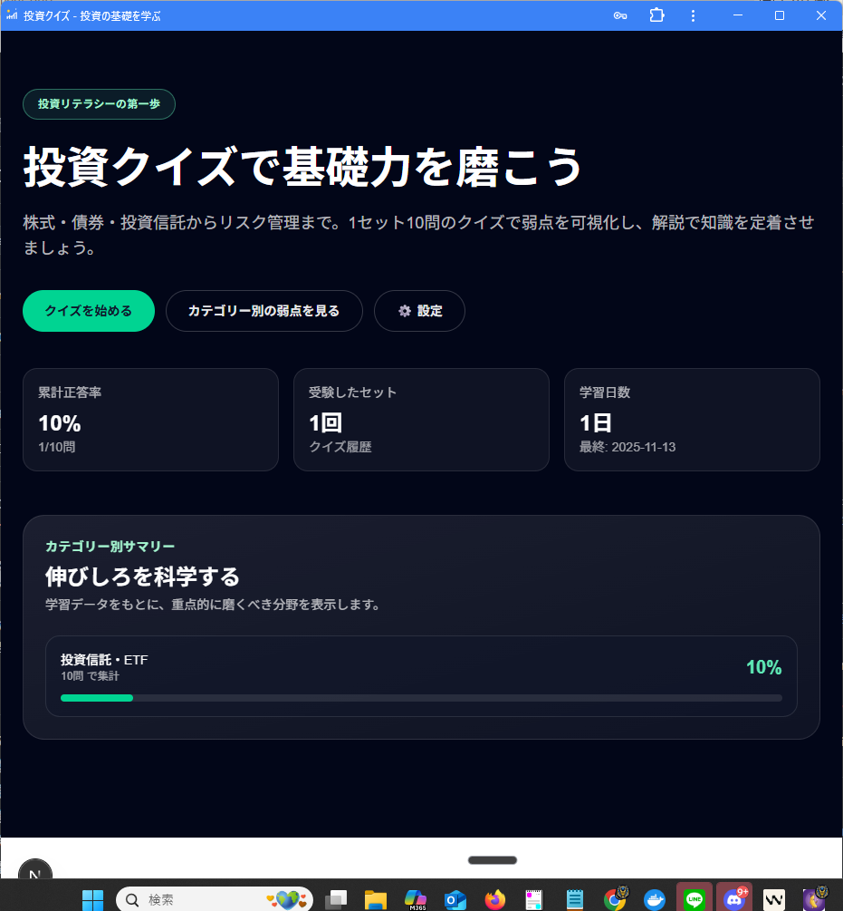

# 投資クイズアプリ

投資の基礎知識を楽しく学べるクイズアプリケーションです。株式、債券、投資信託、リスク管理などのカテゴリー別に問題を解いて、投資の知識を身につけましょう。



## 🎯 特徴

- **54問のプリセット問題**: 6つのカテゴリーに分類された投資に関する問題
- **復習モード**: 間違えた問題だけを復習できる機能
- **学習進捗管理**: カテゴリー別の正答率、学習日数、受験回数などを記録
- **直感的なUI**: Tailwind CSSを使用したモダンなデザイン
- **完全TDD**: Jest + React Testing Libraryで76個のテスト、カバレッジ87.12%達成
- **堅牢なエラーハンドリング**: Gemini API Rate Limit対応、データバリデーション実装
- **包括的E2Eテスト**: Playwright で18ケースの自動テスト実装

## 📚 カテゴリー

1. 株式投資の基本（10問）
2. 債券投資の基本（8問）
3. 投資信託・ETF（10問）
4. リスク管理（10問）
5. 税金・制度（8問）
6. 経済用語（8問）

## 🚀 セットアップ

### 前提条件

- Node.js 18.x以上
- npm または yarn

### インストール

```bash
# リポジトリをクローン
git clone <repository-url>
cd app029-investment-quiz/app029

# 依存パッケージをインストール
npm install

# 開発サーバーを起動
npm run dev
```

ブラウザで [http://localhost:3000](http://localhost:3000) を開いてください。

## 🧪 テスト

```bash
# 全テストを実行
npm test

# カバレッジ付きでテスト実行
npm test -- --coverage

# テストをウォッチモードで実行
npm run test:watch
```

## 🏗️ ビルド

```bash
# 本番用ビルド
npm run build

# 本番サーバーを起動
npm start
```

## 🎨 技術スタック

- **フレームワーク**: Next.js 16 (App Router)
- **言語**: TypeScript
- **スタイリング**: Tailwind CSS 4
- **状態管理**: Zustand
- **テスト**: Jest + React Testing Library
- **E2Eテスト**: Playwright

## 📁 プロジェクト構造

```
app029/
├── src/
│   ├── app/                    # Next.js App Router
│   │   ├── components/         # UIコンポーネント
│   │   │   ├── Home.tsx
│   │   │   └── quiz/
│   │   │       ├── QuizShell.tsx
│   │   │       └── ExplanationCard.tsx
│   │   ├── page.tsx            # ホームページ
│   │   └── quiz/
│   │       └── page.tsx        # クイズページ
│   ├── lib/                    # ライブラリ・ユーティリティ
│   │   ├── types.ts            # 型定義
│   │   ├── quizEngine.ts       # クイズロジック
│   │   ├── questionBank.ts     # 問題管理
│   │   ├── questionValidation.ts # 問題データバリデーション
│   │   ├── geminiService.ts    # AI機能（Gemini API）
│   │   └── storage.ts          # ローカルストレージ
│   ├── store/                  # Zustand状態管理
│   │   └── useQuizStore.ts
│   ├── data/                   # 問題データ
│   │   └── questions.json
│   └── __tests__/              # ユニットテスト
│       ├── quizEngine.test.ts
│       ├── useQuizStore.test.ts
│       ├── questionValidation.test.ts
│       ├── geminiService.test.ts
│       └── ...
├── e2e/                        # E2Eテスト（Playwright）
│   ├── quiz-flow.spec.ts       # クイズフローテスト
│   ├── results-and-stats.spec.ts # 結果・統計テスト
│   ├── review-mode.spec.ts     # 復習モードテスト
│   └── ai-features.spec.ts     # AI機能テスト
└── doc/
    └── implementation.md       # 実装計画書
```

## 🔧 機能詳細

### クイズ機能

- カテゴリー別出題（各カテゴリー10問）
- ランダム出題（全カテゴリーから10問）
- 復習モード（間違えた問題のみ出題）
- 問題ごとの詳細な解説
- リアルタイムの進捗表示

### 学習管理

- カテゴリー別正答率
- 累計正答率
- 学習日数カウント
- 受験したセット数
- 間違えた問題の自動記録

### データ品質保証

- **包括的バリデーション**: 問題データの整合性チェック
  - 必須フィールド検証（ID、カテゴリー、問題文、選択肢、正解、解説、難易度）
  - 選択肢の数と正解インデックスの整合性チェック
  - 重複選択肢の検出
  - テキスト長の妥当性検証
- **ロード時検証**: アプリケーション起動時の自動データ検証
- **問題ID重複検出**: 問題バンク全体での一意性保証

### AI機能（オプショナル）

Gemini APIを使用したAI機能が実装されています（要APIキー）:

- **問題の自動生成**: カテゴリー別に新しい問題を生成
- **解説の強化**: より詳しい解説を提供
- **弱点診断とアドバイス**: 学習履歴に基づく分析

**堅牢なエラーハンドリング**:
- Rate Limit（429エラー）対応の指数バックオフリトライ
- 生成問題の品質チェック（重複検出、長さバリデーション）
- ネットワークエラーの適切なハンドリング

環境変数 `GEMINI_API_KEY` を設定することで利用可能になります。

```bash
# .env.local
GEMINI_API_KEY=your-api-key-here
```

**セキュリティ**: APIキーは環境変数で管理され、リポジトリにコミットされません。

## 📊 テスト

プロジェクトは完全なTDDアプローチで開発されており、以下のテストカバレッジを実現しています:

### ユニットテスト（Jest + React Testing Library）
- **テストケース**: 76個（全てパス ✅）
- **コードカバレッジ**: 87.12%
  - Statements: 87.12%
  - Branches: 81.48%
  - Functions: 88.88%
  - Lines: 87.12%

### E2Eテスト（Playwright）
- **テストケース**: 18個
  - クイズフロー: 3ケース
  - 結果・統計: 5ケース
  - 復習モード: 4ケース
  - AI機能: 6ケース（APIキー必要分はskip設定）

### テスト実行方法

```bash
# ユニットテスト
npm test                    # 全テスト実行
npm test -- --coverage      # カバレッジ付き
npm run test:watch          # ウォッチモード

# E2Eテスト
npx playwright test         # 全E2Eテスト実行
npx playwright test --ui    # UIモードで実行
npx playwright test --headed # ヘッド付きブラウザで実行
```

## ⚠️ 免責事項

**重要**: このアプリケーションは教育目的のみで提供されています。

- 本アプリケーションは投資教育のための学習ツールです
- **投資助言や金融商品の推奨を目的としたものではありません**
- 実際の投資判断は、必ず専門家に相談してください
- 本アプリケーションの情報に基づく投資判断による損失について、開発者は一切責任を負いません
- 投資はリスクを伴います。自己責任で行ってください

## 📝 開発プロセス

このプロジェクトはTDD（Test-Driven Development）の原則に従って開発されました:

1. **Red**: テストを先に書く
2. **Green**: テストをパスする最小限の実装
3. **Refactor**: コードの品質を向上

### 実装フェーズ
- **Phase 0-7**: コア機能実装（問題管理、クイズエンジン、UI、統計、復習モード、AI機能）
- **Phase 8**: エラーハンドリング・品質保証
  - データバリデーション実装
  - Gemini API Rate Limit対応（指数バックオフ）
  - 生成問題の品質チェック
- **Phase 9**: E2Eテスト実装
  - クイズフロー自動テスト
  - 結果・統計表示テスト
  - 復習モード動作確認
  - AI機能統合テスト

詳細は `doc/implementation.md` を参照してください。

## 📄 ライセンス

このプロジェクトは教育目的で作成されています。

## 🤝 貢献

バグ報告や機能要望は、GitHubのIssueでお願いします。

## 👨‍💻 作者

[プロジェクト作成者名]

---

**注意**: 実際の投資を行う前に、必ず金融の専門家にご相談ください。本アプリケーションは教育目的のみで、投資助言を提供するものではありません。
